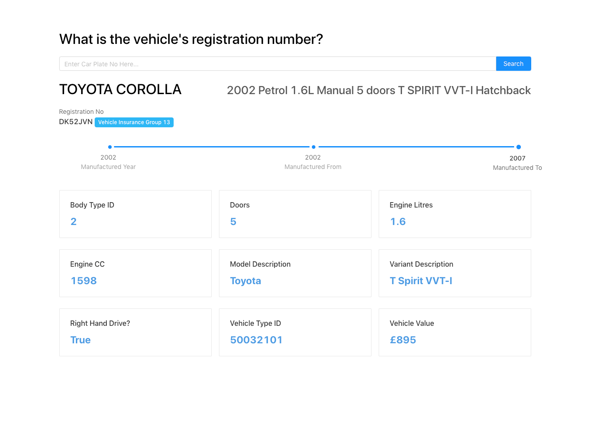

# UK Car Search Engine

### A simple react SPA that allows one to search for UK cars using their registration number

The app digs out important information about any car using the DVLA's database of registered cars in the UK. This is achieved by reverse-engineering a moneysupermarket's API. 
*This application can only make API calls from a node backend. Would not work just using a front-end only application this why the backend for this application was very small*.

## Motivation
This app was created because I could not find a simple to use car search engine during my car hunt when I was in need of buying a new vehicle. So I decided to create 

## Usage
Just `cd` into the server and client folders. While you are in those folder just make sure you have Node.js and nodemon globally installed and `npm run start` in the two folders using any terminal of your liking. Nodemon is needed to ensure the express server runs constantly without the need of constantly restarting it.

## Deployment
Any free services can host the application without any issues. There are services like now.sh, netlify.com, glitch.com, stackblitz.com that can host your React application. One can also host the express server on Heroku.

## Todo
1. Add ability to view MOT???
## Screenshot
